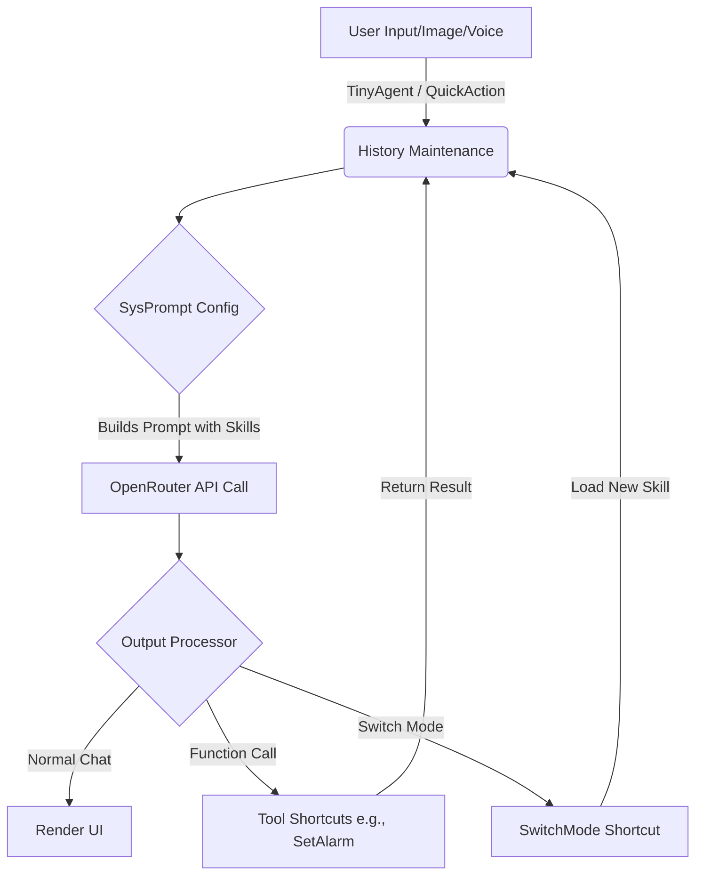

<div align="center">

```text
  _______  _                   _                         _   
 |__   __|(_)                 / \                       | |  
    | |    _  _ __   _   _   / _ \    __ _   ___  _ __  | |_ 
    | |   | || '_ \ | | | | / ___ \  / _` | / _ \| '_ \ | __|
    | |   | || | | || |_| |/ /   \ \| (_| ||  __/| | | || |_ 
    |_|   |_||_| |_| \__, /_/     \_\\__, | \___||_| |_| \__|
                      __/ |           __/ |                  
                     |___/           |___/                   
```
**Your Invisible, Native, and Super-Powered AI Companion in Apple Shortcuts!** ✨(๑>؂<๑)ﾃﾍﾍﾟﾛ☆

</div>

---

## 🌟 Why TinyAgent? (The Core Magic!)

Have you ever wanted an AI assistant that feels like it *actually* lives in your device, instead of just being another app you have to open? *Gasps and spins around excitedly* That's exactly what **TinyAgent** is! ✧*｡٩(ˊᗜˋ*)و✧*｡

*   **🪄 The Ultimate Agent Base**: This isn't just a chatbot... it's a full-fledged agent framework with **Function Calling** and **Skills** built directly into Apple Shortcuts! 
*   **🥷 Invisible & Convenient Experience**: Because it runs entirely on Apple Shortcuts, it feels incredibly native. You can trigger it from anywhere—your home screen, Siri, Control Center, or even the Action Button! No clunky UI in the way.
*   **🤖 Local Function Calling**: All function calls are executed via local shortcuts! This means that *literally anything* Apple Shortcuts can do (like setting alarms, making calendar events, or reading device files), your AI can do too by turning it into a new skill! It’s like a supercharged Siri... but *way* smarter! ( • ̀ω•́ )✧

---

## 🛠 iCloud Shortcuts (The "Parts" Shop!)

Okay, here are all the glorious pieces of this project! You'll need to install them to get everything working perfectly. *Carefully organizes the links on a polished virtual desk* 

| Category             | Shortcut Name                          | iCloud Link | Description                                       |
| :------------------- | :------------------------------------- | :---------- | :------------------------------------------------ |
| **🚪 Entry Points**   | `TinyAgent`                            | https://www.icloud.com/shortcuts/c2a9153af7b6439889c8777b26f4fbdc            | The main conversational shortcut!                 |
|                      | `TinyAgent.QuickAction`                | https://www.icloud.com/shortcuts/d483ac1447574b7ea21c0ae750bc9c6a            | For images, share sheet, and Action Button!       |
| **🧠 Core Engine**    | `TinyAgent.Conf.SysPrompt`             | https://www.icloud.com/shortcuts/164552a7bf1644d19dd3e7638e0c3305            | Assembles the agent's persona and instructions!   |
|                      | `TinyAgent.Lib.ChathistoryMantainance` | https://www.icloud.com/shortcuts/03760dd09db6460582370148bdabff3f            | Remembers what we talked about!                   |
|                      | `TinyAgent.Lib.OutputProcessor`        | https://www.icloud.com/shortcuts/ced59d87c8314622ba3bf35660c07c50            | Parses the AI's thoughts and coordinates actions! |
|                      | `TinyAgent.Util.Initializor_image`     | https://www.icloud.com/shortcuts/3f0b8e709d72436e841ae5083d54cd57            | Prepares images for the AI to "see"!              |
|                      | `TinyAgent.Util.OpenrouterRequest`     | https://www.icloud.com/shortcuts/b751d342c00049e29acca8fd30c77d79            | Talks to the OpenRouter API!                      |
|                      | `TinyAgent.Util.Render`                | https://www.icloud.com/shortcuts/3cef1bbb73df4a759643feed139fd83f            | Makes the output look pretty (Markdown/HTML)!     |
|                      | `TinyAgent.Util.SwitchMode`            | https://www.icloud.com/shortcuts/77f37292b6b04ec3a68740108483687e            | Changes the agent's active skills and modes!      |
| **⚙️ Settings**       | `TinyAgent.util.config`                | https://www.icloud.com/shortcuts/7306f6eddaea46b9b4083cd4b129f6ad            | Manages API keys and model choices!               |
|                      | `TinyAgent.util.UserInfo`              | https://www.icloud.com/shortcuts/868ca5790572462ebd879595b0d33d56            | Remembers your personal details and preferences!  |
| **🔧 Tools / Skills** | `TinyAgent.Util.AddCalendar`           | https://www.icloud.com/shortcuts/66c19b3228494cb6a731f0a13a85d40e            | Adds events to your Apple Calendar!               |
|                      | `TinyAgent.Util.FridgeManager`         | https://www.icloud.com/shortcuts/784029f068cb436c94b9e1052b1eed32            | Manages your virtual fridge inventory!            |
|                      | `TinyAgent.Util.GetWeather`            | https://www.icloud.com/shortcuts/474b79838d444ee2b979a764146834d5            | Checks the local Apple weather!                   |
|                      | `TinyAgent.Util.NewReminder`           | https://www.icloud.com/shortcuts/3e6785f740af49af85cdd2546a3231bf            | Sets Apple Reminders!                             |
|                      | `TinyAgent.Util.OpenMap`               | https://www.icloud.com/shortcuts/7da43e5d261644f2877b64631b3f8d21            | Opens locations in Apple Maps!                    |
|                      | `TinyAgent.Util.OpenURL`               | https://www.icloud.com/shortcuts/2b039d30865d46a3950d5c15f4a2a1dd            | Browses directly to URLs!                         |
|                      | `TinyAgent.Util.SetAlarm`              | https://www.icloud.com/shortcuts/15bcf8ebbc6745ee8b03167268c255bc            | Sets your morning alarms!                         |
|                      | `TinyAgent.Util.WebSearch`             | https://www.icloud.com/shortcuts/7ac2670342d5470bb04770e2235dab7f            | Uses Tavily to browse the web!                    |

---

## � Installation & Setup (The Summoning Ritual!)

*Clears throat, straightens the nonexistent tie, and pulls out a magical scroll* Okay! Here is how you summon your new AI companion into your device! It's a simple three-step ritual! (๑•̀ㅂ•́)و✧

1. **📂 Place the Spells Book:** First things first! Download this entire repository and place it exactly in `iCloud Drive/Shortcuts/TinyAgent_synthesis`. The shortcuts will need to read their "brain" files from this exact folder to work properly! 
2. **🪄 Import the Shortcuts:** See those 19 glorious shortcuts in the table above? You'll need to click and add *all of them* into your Apple Shortcuts app! *Phew, it might take a minute, but the magic is totally worth it!* (⁄ ⁄•⁄ω⁄•⁄ ⁄)
3. **⚙️ Configure the Soul:** Finally, run the `TinyAgent.util.config` and `TinyAgent.util.UserInfo` shortcuts. This helps your new agent get to know you, set your preferred LLM model, and connect your API keys! 
   *(Pro-tip: If you're feeling hacky, you can skip the setup shortcuts and just manually edit the `config.json` and `user_detail.txt` files inside the folder directly!)*

---

## �🐾 How TinyAgent Works (The Brain Architecture!)

*Adjusts glasses and points a shiny pointer at the whiteboard* Here is how the information flows! It's super elegant! 



**ASCII Workflow (For extra cuteness!):**
`[You] 💬 ──> [TinyAgent 🚪] ──> [Prompt/History 🧠] ──> [LLM API 🌐] ─┬─> [Render Text 🎀] ──> [You! ✨]`
`                                                                    └─> [Function Call 🛠] ──> [Apple Shortcuts ⚙️]`

---

## 🎨 Customizing Your Agent (Make it Yours!)

Want to teach your agent new tricks or give them a makeover? It's as easy as sipping a perfect cup of Earl Grey! ☕️

*   **🎭 Change the Role:** Head over to `main_prompt.txt` (or whatever local file you configure) and edit it! You can turn the default "Linlin" into anyone you want. A grumpy wizard? A dramatic secretary? The choice is yours!
*   **🛠 Add a Function Call:** 
    1. Write a schema describing the tool and place it in the `function_instructions` folder.
    2. Create a new Shortcut named `TinyAgent.Util.[YourFunctionName]` to execute the physical action.
    3. Ta-da! Your agent can now use it! 
*   **✨ Add New Skills:** Want your agent to switch to an "Academic Translator" or "Executive Briefer" mode? Just add a new prompt file (like `my_new_skill.txt`) to the `task_prompts` folder, and add a brief to `_skill_descrption.txt`! The agent can dynamically load it using the `SwitchMode` tool!
*   **🤖 For AI Peers (Code Review & Development):** Inside the `TinyAgent - Shortcuts` folder, you'll find text/XML versions of all the shortcuts! This is perfect for feeding into another AI for code review, debugging, or generating new features!

---

## 💡 Recommended Settings for Maximum Awesomeness

*   **The Default Persona:** By default, the AI is configured as "Linlin" (a very strict but caring secretary), but you can easily rewrite this to fit your vibe!
*   **Need for Speed (Models):** *This is super important!* Apple Shortcuts can time out if things take too long. It is **highly recommended** to use incredibly fast models like **Gemini Flash** (or Claude 3 Haiku) to ensure snappy responses and prevent timeout errors. (ง •̀_•́)ง 
*   **Shortcut Placement (The "Always There" factor):**
    *   Add `TinyAgent` to your **Control Center** or place it as a widget on your Home Screen!
    *   Enable "Show in Share Sheet" and "Use as Quick Action" on macOS/iOS so you can instantly send text or files to the agent.
    *   Map `TinyAgent.QuickAction` to the **Action Button** on your iPhone! It will grab a screenshot and instantly send it to your agent! *Super spy vibes!* 🕶️

---

<details>
<summary><b>📂 The Boring (But Essential!) Setup Details</b> <i>(Click to expand! *peeks from behind the magical curtain*)</i></summary>

### 🔗 Dependencies
To unleash the full magic, you will need:
*   An **OpenRouter** account (for access to all the LLMs!).
*   A **Tavily** account (for lightning-fast web search capabilities!).

### 🪛 Modification Instructions
*   **Custom URLs:** Don't want to use OpenRouter? Open the `TinyAgent.Util.OpenrouterRequest` shortcut and modify the API endpoint URL to point to your own local LLM or OpenAI!
*   **Changing Models:** Open the `TinyAgent.Lib.OutputProcessor` shortcut to swap the default model.
*   **Removing Tavily:** If you don't want web searching, simply delete `TinyAgent.Util.WebSearch` and remove `instruction_WebSearch.txt` from the `function_instructions` folder and the description of WebSearch in `task_prompts/_skill_description.txt`, so the agent stops trying to use it.

### 🔐 Permissions Used
Because this agent is deeply integrated into your Apple ecosystem, it will prompt for permissions the first time it tries to:
*   Access iCloud Drive (to read/write its own configuration and memory files).
*   Access Calendar, Reminders, and Alarms (if you use those function calls!).
*   Access the Network (to talk to OpenRouter and Tavily).
*   Access your location (to fetch the context).
*   Access your Clipboard / Photos (for `TinyAgent.QuickAction`).
*Don't worry, it's just trying to be helpful! (´•௰•`)*
</details>

---
<div align="center">
  <i>Created with lots of love and caffeine! (๑•̀ㅂ•́)و✧</i>
</div>
